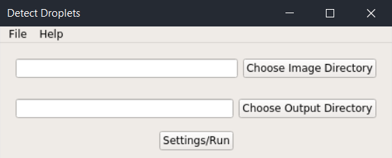
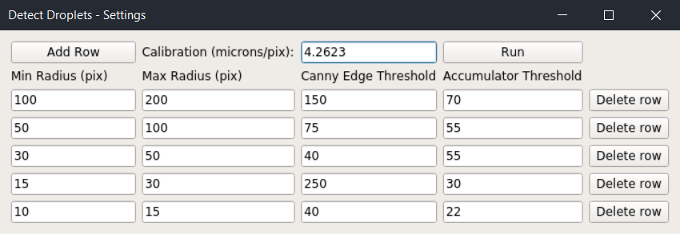
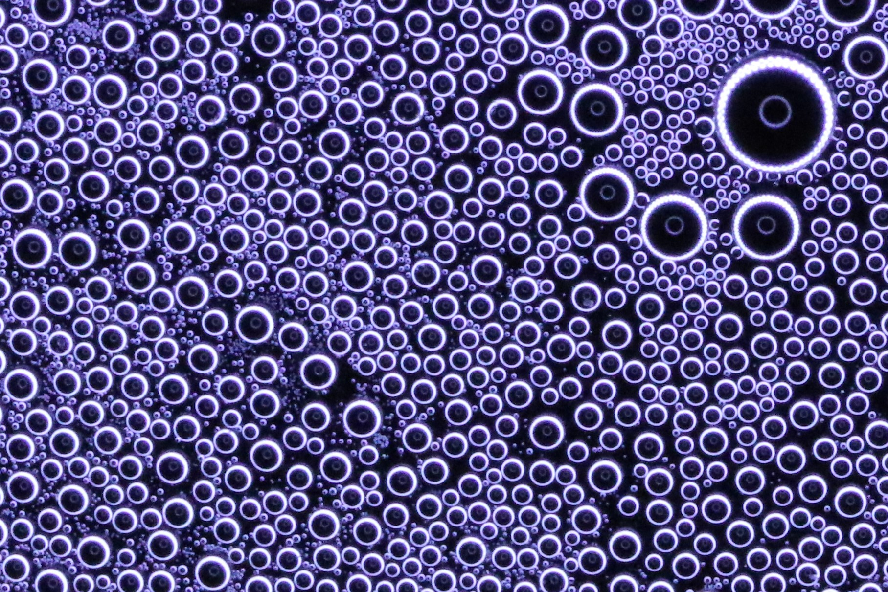
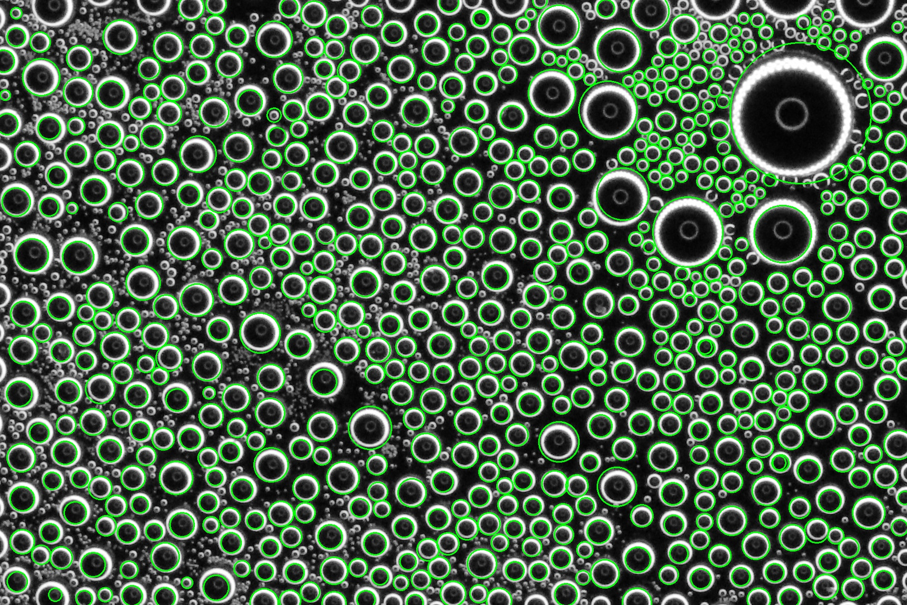

# Detect Droplets

A program that uses OpenCV3 for finding droplets during condensation. Gives droplet number densities based on the [Rose model of dropwise condensation](#additional-references).

## Requirements
- Python 3
- OpenCV
- NumPy
- PyQt5

## Installation Instructions
Clone the repository inside your current directory:
```
$ git clone https://github.com/alex-wuu/detect-droplets.git detect-droplets
$ cd detect-droplets
```

Install virtualenv if you don't have it:
```
$ pip install virtualenv
```

Create your virtual environment with virtualenv if desired. `venv` can be changed to the virtual environment name of your choice:
```
$ virtualenv venv
```

Activate your virtual environment:
```
$ source venv/bin/activate
```

Install package dependencies with pip:
```
$ pip install -r requirements.txt
```

## Usage

Run by doing:
```
$ python app.py
```

You should see a window like this:



Select the directories for your images and output, and then enter in your settings in the window that comes up from clicking Settings/Run:



Processed images will be saved as a JPEG to the directory of your choice with filenames ending in `_out` and a CSV file named `out.csv` will contain the number densities for each range of droplet sizes. A settings file is also saved as `settings.csv` in the output directory.

Parameters for `cv2.HoughCircles` (named Canny Edge Threshold and Accumulator Threshold here) will need to be set and played around with to achieve good results. See the [OpenCV documentation](https://docs.opencv.org/trunk/dd/d1a/group__imgproc__feature.html#ga47849c3be0d0406ad3ca45db65a25d2d) and [Wikipedia](https://en.wikipedia.org/wiki/Circle_Hough_Transform) for more information.

Click the Run button and wait for the processing to finish.

Here is an example of what the output image can look like (original first, output second, and settings in the above image):
 

## Additional References

[J.W. Rose, L.R. Glicksman, Dropwise condensation—The distribution of drop sizes, Int. J. Heat Mass Transfer __16__ (1973) 411-425.](https://doi.org/10.1016/0017-9310(73)90068-9)

[Y.-T. Wu, C.-X. Yang, X.-G. Yuan, Drop distributions and numerical simulation of dropwise condensation heat transfer, Int. J. Heat Mass Transfer __44__ (2001) 4455-4464.](https://doi.org/10.1016/S0017-9310(01)00085-0)

[J.W. Rose, Dropwise condensation theory and experiment: A review, Proc. Inst. Mech. Eng. A __216__ (2002) 115-128.](https://doi.org/10.1243/09576500260049034)

[P.B. Weisensee, Y. Wang, Q. Hongliang, D. Schultz, W.P. King, N. Miljkovic, Condensate droplet size distribution on lubricant-infused surfaces, Int. J. Heat Mass Transfer __109__ (2017) 187-199.](https://doi.org/10.1016/j.ijheatmasstransfer.2017.01.119)
